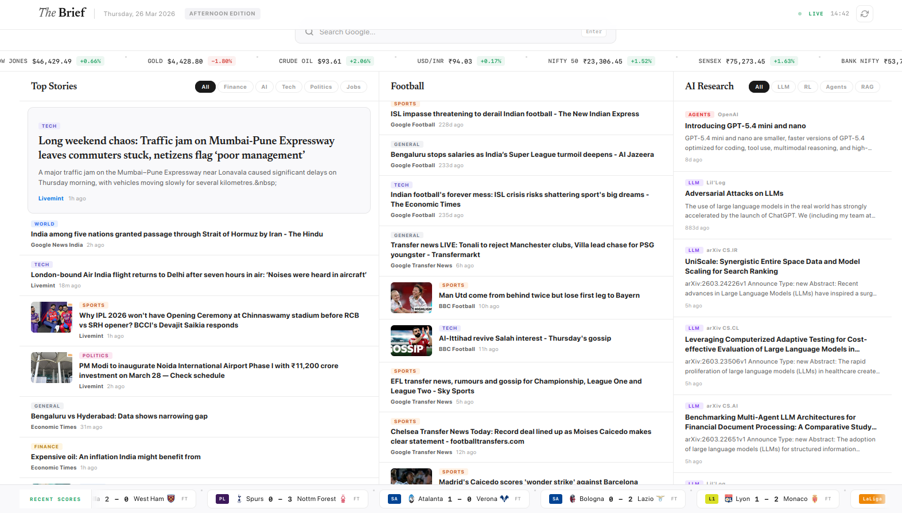

<div align="center">


<br>

<p>
<a href="https://python.org"></a>
<a href="https://flask.palletsprojects.com"></a>
<a href="LICENSE"></a>
<a href="https://render.com"></a>
<a href="https://github.com/shankha06/robo-news-brief/stargazers"></a>
</p>

<p>A personal intelligence dashboard that aggregates <strong>news</strong>, <strong>football</strong>, <strong>AI/ML research</strong>, and <strong>live market data</strong><br>into a single, beautifully crafted interface — so you never scroll through ten sites again.</p>

<p>
<a href="#-quick-start">Quick Start</a>&nbsp;&nbsp;·&nbsp;&nbsp;<a href="#-features">Features</a>&nbsp;&nbsp;·&nbsp;&nbsp;<a href="#%EF%B8%8F-configuration">Configuration</a>&nbsp;&nbsp;·&nbsp;&nbsp;<a href="#-deployment">Deployment</a>&nbsp;&nbsp;·&nbsp;&nbsp;<a href="#-tech-stack">Tech Stack</a>
</p>

<br>

<a href="https://robo-news-brief.onrender.com/">

</a>

<br><br>

</div>

<!-- ━━━━━━━━━━━━━━━━━━━━━━━━━━━━━━━━━━━━━━━━━━━━━━━━━━━━━━━━━━━━━━━━━━━━━ -->

## ✦ Why The Brief?

> **One tab. Every morning. Everything that matters.**

Most people start their day cycling through a dozen bookmarks — news sites, market tickers, football scores, arXiv feeds, Google searches. **The Brief** collapses all of that into a single, opinionated dashboard that loads in seconds and needs zero configuration.

<br>

> [!NOTE]
> **Zero API keys required.** Every data source is free and public — RSS feeds, Yahoo Finance, ESPN endpoints. Clone, run, done.

<br>

<!-- ━━━━━━━━━━━━━━━━━━━━━━━━━━━━━━━━━━━━━━━━━━━━━━━━━━━━━━━━━━━━━━━━━━━━━ -->

## ✦ Features

<table>
<tr>
<td width="50%" valign="top">

<h3>📰&nbsp; Top Stories</h3>

Curated from **12+ sources** — NDTV, Times of India, Economic Times, Livemint, Moneycontrol, BBC, TechCrunch, and Google News. Every article is **scored by relevance** (India-first, finance, tech, geopolitics) and **auto-tagged** by category.

**Filters:** &nbsp; `Finance` &nbsp; `AI` &nbsp; `Tech` &nbsp; `Politics` &nbsp; `Jobs`

</td>
<td width="50%" valign="top">

<h3>🧠&nbsp; AI / ML Research</h3>

Papers and posts from **arXiv** (CS.CL · CS.AI · CS.LG · CS.IR), **OpenAI**, **Anthropic**, **Google AI**, **HuggingFace**, **The Gradient**, and **Lil'Log**. Prioritized by topic — LLMs, RL, retrieval, ranking, and agents rank higher.

**Filters:** &nbsp; `LLM` &nbsp; `RL` &nbsp; `Agents` &nbsp; `RAG`

</td>
</tr>
<tr>
<td width="50%" valign="top">

<h3>📈&nbsp; Live Market Ticker</h3>

Auto-scrolling strip with real-time data via Yahoo Finance:

**India** &nbsp; NIFTY 50 · SENSEX · BANK NIFTY · NIFTY IT<br>
**US** &nbsp; S&P 500 · NASDAQ · DOW JONES<br>
**Commodities** &nbsp; Gold · Crude Oil · USD/INR

</td>
<td width="50%" valign="top">

<h3>⚽&nbsp; Football</h3>

Breaking news from **BBC Sport**, **ESPN FC**, and **Google News**. Transfer rumors, match previews, post-match analysis — all in one column.

**Scores banner** with results from the last 7 days across PL, UCL, La Liga, Bundesliga, Serie A, Ligue 1, and more.

</td>
</tr>
</table>

<br>

<details>
<summary><strong>&nbsp;More highlights</strong></summary>

<br>

| | Feature | Details |
|---|---|---|
| 📖 | **Built-in article reader** | Read full articles in a modal overlay — never leave the dashboard |
| 🔍 | **Integrated Google search** | Search bar baked into the header, opens results in a new tab |
| 🌅 | **Edition-aware header** | Automatically shows Morning, Afternoon, or Evening edition |
| ⚡ | **Smart caching** | Feeds: 5 min · Scores: 10 min — fast without hammering sources |
| 💀 | **Skeleton loaders** | Polished loading states while data is being fetched |
| 🏗️ | **Zero build step** | No webpack, no bundler, no framework — vanilla HTML/CSS/JS |

</details>

<br>

<!-- ━━━━━━━━━━━━━━━━━━━━━━━━━━━━━━━━━━━━━━━━━━━━━━━━━━━━━━━━━━━━━━━━━━━━━ -->

## ✦ Quick Start

> [!TIP]
> The fastest path is with [**uv**](https://docs.astral.sh/uv/getting-started/installation/) — it handles the virtualenv and all dependencies in one command.

```bash
git clone https://github.com/shankha06/robo-news-brief.git
cd robo-news-brief
uv run python app.py
```

Then open **http://localhost:5566** — that's it.

<br>

<details>
<summary><strong>&nbsp;Manual setup with pip</strong></summary>

<br>

```bash
git clone https://github.com/shankha06/robo-news-brief.git
cd robo-news-brief

python -m venv .venv
source .venv/bin/activate          # Windows: .venv\Scripts\activate
pip install -r requirements.txt

python app.py
```

</details>

<details>
<summary><strong>&nbsp;Run with Docker</strong></summary>

<br>

```bash
docker build -t the-brief .
docker run -p 8080:8080 the-brief
```

Open **http://localhost:8080**.

</details>

<br>

<!-- ━━━━━━━━━━━━━━━━━━━━━━━━━━━━━━━━━━━━━━━━━━━━━━━━━━━━━━━━━━━━━━━━━━━━━ -->

## ✦ Configuration

All settings live at the top of [**`app.py`**](app.py) — no config files, no env vars, just Python dicts:

<br>

<table>
<thead>
<tr>
<th width="28%">Setting</th>
<th width="48%">What it controls</th>
<th width="24%">Default</th>
</tr>
</thead>
<tbody>
<tr><td><code>RSS_FEEDS</code></td><td>News sources per category — top news, football, AI</td><td>25+ feeds</td></tr>
<tr><td><code>STOCK_SYMBOLS</code></td><td>Tickers in the scrolling market strip</td><td>Indian &amp; US indices + commodities</td></tr>
<tr><td><code>FOOTBALL_LEAGUES</code></td><td>Which leagues to pull match scores from</td><td>PL, UCL, La Liga, +5 more</td></tr>
<tr><td><code>TOP_TEAMS</code></td><td>Clubs that qualify as "top-performing"</td><td>~60 clubs across 8 leagues</td></tr>
<tr><td><code>HIGH_PRIORITY_KEYWORDS</code></td><td>Keywords that boost article ranking score</td><td>India, finance, tech, geopolitics</td></tr>
<tr><td><code>AI_PRIORITY_KEYWORDS</code></td><td>Keywords that boost AI research ranking</td><td>LLM, RL, agents, RAG</td></tr>
<tr><td><code>CACHE_TTL</code></td><td>How long data stays cached before refresh</td><td>5 min (feeds) · 10 min (scores)</td></tr>
</tbody>
</table>

<br>

<!-- ━━━━━━━━━━━━━━━━━━━━━━━━━━━━━━━━━━━━━━━━━━━━━━━━━━━━━━━━━━━━━━━━━━━━━ -->

## ✦ Deployment

<table>
<tr>
<td align="center" width="33%" valign="top">

<br>


**Render**

One-click deploy with the included<br>[`render.yaml`](render.yaml):

<br>

[](https://render.com/deploy)

<br>

</td>
<td align="center" width="33%" valign="top">

<br>


**Docker**

```
docker build -t the-brief .
docker run -p 8080:8080 the-brief
```

<br>

</td>
<td align="center" width="33%" valign="top">

<br>


**Heroku**

[`Procfile`](Procfile) included:

```
heroku create the-brief
git push heroku main
```

<br>

</td>
</tr>
</table>

<br>

<!-- ━━━━━━━━━━━━━━━━━━━━━━━━━━━━━━━━━━━━━━━━━━━━━━━━━━━━━━━━━━━━━━━━━━━━━ -->

## ✦ Tech Stack

<div align="center">

<br>

<a href="https://python.org"></a>&nbsp;&nbsp;
<a href="https://flask.palletsprojects.com"></a>&nbsp;&nbsp;
<a href="https://developer.mozilla.org/en-US/docs/Web/HTML"></a>&nbsp;&nbsp;
<a href="https://developer.mozilla.org/en-US/docs/Web/CSS"></a>&nbsp;&nbsp;
<a href="https://developer.mozilla.org/en-US/docs/Web/JavaScript"></a>&nbsp;&nbsp;
<a href="https://docker.com"></a>

<br><br>

</div>

| Layer | Technology |
|:---|:---|
| **Backend** | Python · Flask · feedparser · yfinance · requests · newspaper4k |
| **Frontend** | Vanilla HTML / CSS / JS — no build step, no framework, no bundler |
| **Typography** | SF Pro (system) · [Newsreader](https://fonts.google.com/specimen/Newsreader) (headlines) · [JetBrains Mono](https://fonts.google.com/specimen/JetBrains+Mono) (tickers) |
| **Data** | RSS feeds (25+) · Yahoo Finance · ESPN Scoreboard — all free, no keys |
| **Infra** | Docker · Render · Heroku · Gunicorn (2 workers, 4 threads) |

<br>

<!-- ━━━━━━━━━━━━━━━━━━━━━━━━━━━━━━━━━━━━━━━━━━━━━━━━━━━━━━━━━━━━━━━━━━━━━ -->

## ✦ Project Structure

```
robo-news-brief/
│
├── app.py                  Flask server — routes, feeds, scoring, caching
│
├── templates/
│   └── index.html          Single-page dashboard (Jinja2)
│
├── static/
│   ├── css/style.css       Light theme, SF Pro, custom properties
│   └── js/app.js           Vanilla JS — fetch, render, filters, reader
│
├── Dockerfile              Multi-stage container build
├── render.yaml             Render one-click deploy config
├── Procfile                Heroku deploy config
├── pyproject.toml          Project metadata & deps (uv)
├── requirements.txt        Fallback deps (pip)
└── uv.lock                 Reproducible lockfile
```

<br>

<!-- ━━━━━━━━━━━━━━━━━━━━━━━━━━━━━━━━━━━━━━━━━━━━━━━━━━━━━━━━━━━━━━━━━━━━━ -->

## ✦ License

Released under the [MIT License](LICENSE).

<br>

<!-- ━━━━━━━━━━━━━━━━━━━━━━━━━━━━━━━━━━━━━━━━━━━━━━━━━━━━━━━━━━━━━━━━━━━━━ -->

<div align="center">


Built by [**Shankhadeep Roy**](https://github.com/shankha06)

<sub>No API keys &nbsp;·&nbsp; No build step &nbsp;·&nbsp; No framework &nbsp;·&nbsp; Just your morning brew of news.</sub>

</div>
